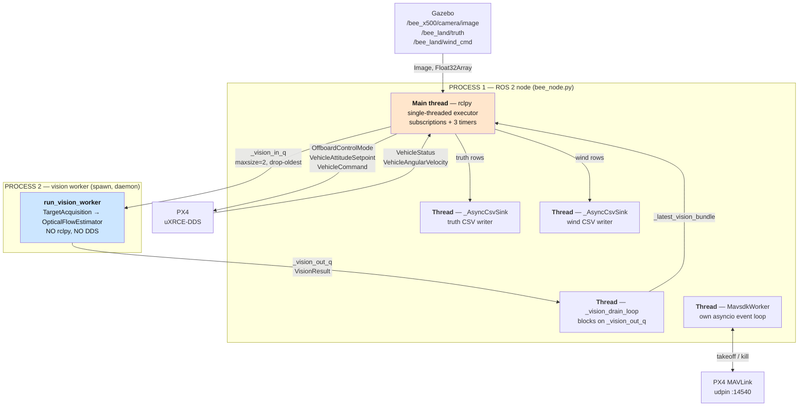
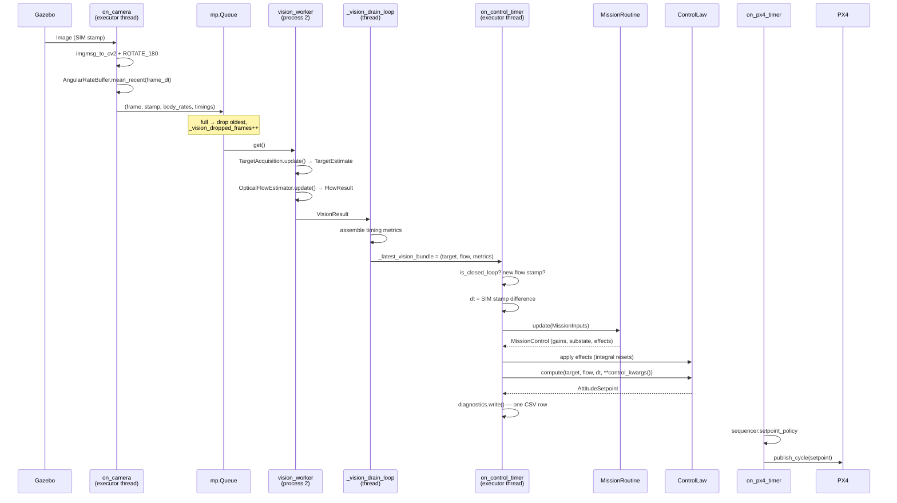
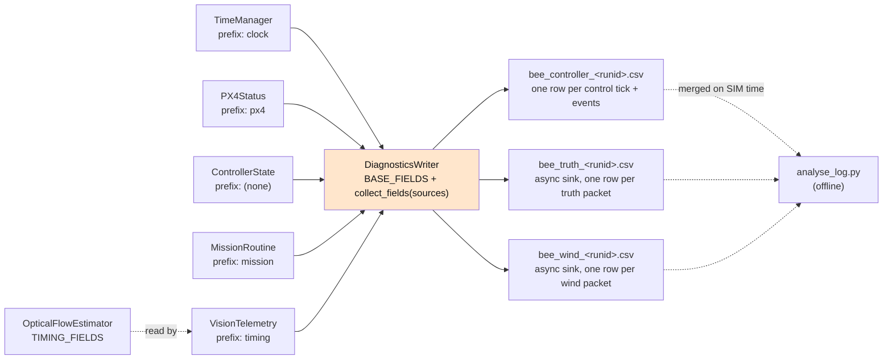
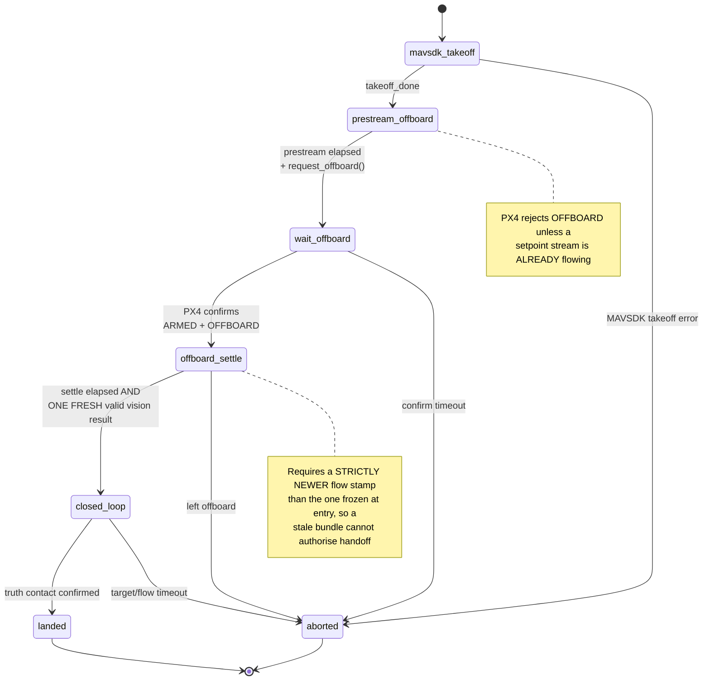
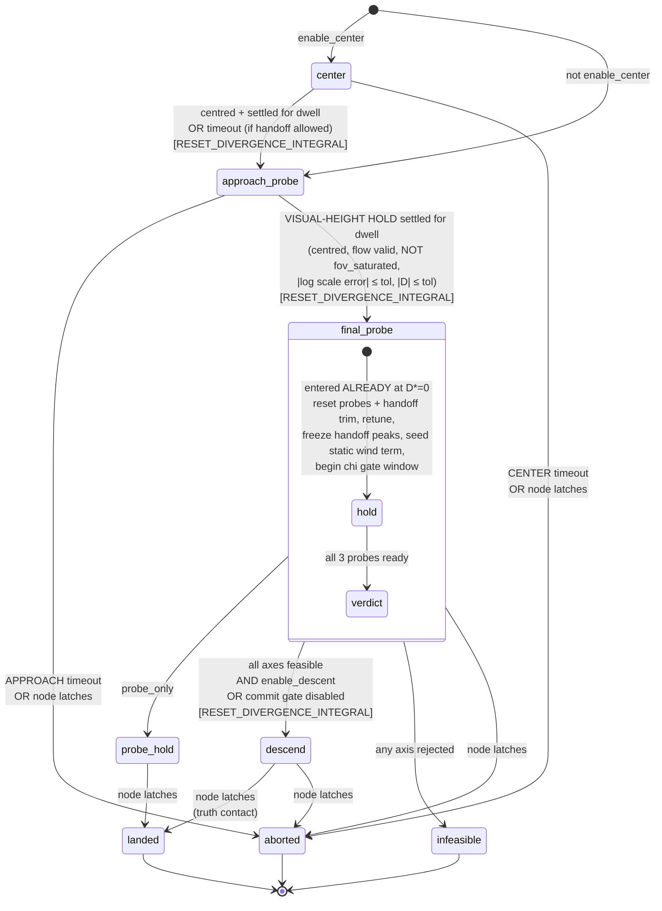
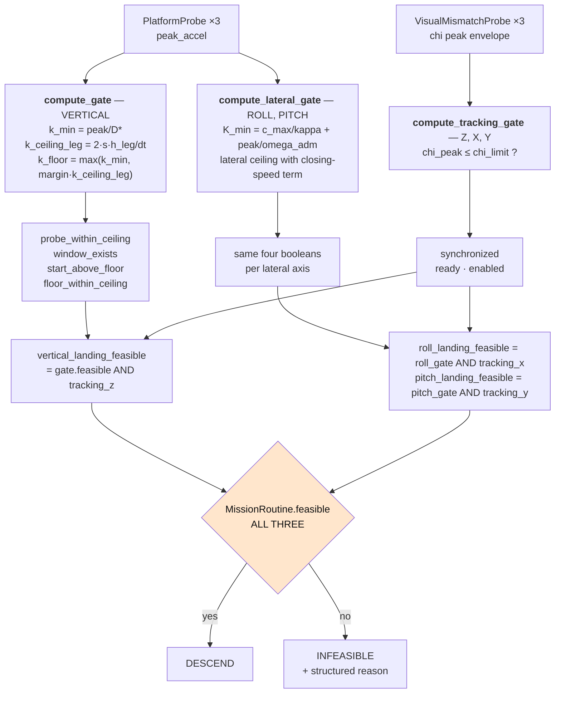

# BEE_LAND — Code Architecture Guide

**Package:** `bee_control` v2.0 · 48 Python files · ~13,900 lines
**Purpose:** bio-inspired, vision-only landing of a PX4 multirotor on a *moving* platform.

This document is a map. It answers three questions in order:

1. **What is where** — the layers, the dependency rules, and what each file owns.
2. **What happens at runtime** — processes, threads, timers, and the path of one camera frame.
3. **Where do I edit** — a task → file lookup table, so you never have to guess again.

Diagrams are shipped both inline (as Mermaid blocks) and as standalone `.mermaid` files.

> **Revision note.** This guide was corrected against the code after the
> wind-rejection work. Three ideas it previously documented were **abandoned**,
> not merely retuned — see §7.8–§7.11. If you remember the old behaviour, read
> those four entries first; the rest of the document assumes the new one.
>
> **Campaign-automation revision.** Every run now ends by itself. `INFEASIBLE`
> became a terminal outcome, CENTER and APPROACH gained operational gates that
> end a stuck run, and the commit gate gained an ablation switch. See §9.

---

## Part 0 — The 60-second map

```
bee_node.py          ROS 2 node. I/O, timers, wiring. Owns nothing conceptual.
core/                shared primitives — clock, config, dataclasses, live state
vision/              camera frames → measurements. Runs in a SEPARATE PROCESS.
mission/             the visual landing sequence (a state machine + feasibility maths)
control/             measurements → attitude/thrust setpoint
interfaces/          talking to the vehicle: PX4 uORB, MAVSDK, the outer lifecycle
diagnostics/         the log schema contract and the two CSV writers
tests/               ROS-free contract tests
```

The single most useful fact about this codebase:

> **There are two state machines, and they are deliberately separate.**
> `FlightSequencer` (in `interfaces/`) owns the **outer** lifecycle — takeoff, offboard,
> handoff, terminal. `MissionRoutine` (in `mission/`) owns the **inner** visual landing
> sequence, and only ever runs *inside* the sequencer's `CLOSED_LOOP` phase.
> They are logged in separate columns (`controller_phase` vs `mission_substate`) and
> must never be conflated.

The second most useful fact:

> **Nothing declares a log column on someone else's behalf.** Each subsystem implements
> `telemetry_fields()` / `telemetry()` and `DiagnosticsWriter` assembles the header from
> whoever is registered. Adding a column is a one-file change.

---

## Part 1 — Layers and dependency direction

### 1.1 The rule

Dependencies point **one way**, down this list:

```
bee_node          (imports everything, imported by nothing)
  ├── interfaces
  ├── mission
  ├── control
  ├── diagnostics
  ├── vision
  └── core        (imports nothing else in the package)
```

If you ever need an import that points *back up* this list, that is the signal a seam is
in the wrong place. The package holds to this today; the one historical exception is
recorded in §7.1.

### 1.2 Verified module dependency graph

This graph was extracted from the AST, not from the docstrings — it is what the code
actually does.

```mermaid
graph TD
    subgraph L0["core — no internal deps"]
        state["core/state.py"]
        clock["core/clock.py"]
        config["core/config.py"]
        ctrlstate["core/controller_state.py"]
    end

    subgraph L1["vision — separate process"]
        targacq["vision/target_acquisition.py"]
        optflow["vision/optical_flow.py"]
        derot["vision/derotation.py"]
        vworker["vision/vision_worker.py"]
    end

    subgraph L2["mission"]
        mtypes["mission/types.py"]
        mutils["mission/math_utils.py"]
        probe["mission/probe.py"]
        vmis["mission/visual_mismatch.py"]
        trim["mission/trim.py"]
        vcad["mission/visual_center_adaptation.py"]
        gates["mission/gates.py"]
        sched["mission/schedule.py"]
        phases["mission/phases/*"]
        routine["mission/routine.py"]
    end

    subgraph L3["control"]
        claw["control/control_law.py"]
    end

    subgraph L4["interfaces"]
        px4i["interfaces/px4_interface.py"]
        mav["interfaces/mavsdk_worker.py"]
        seq["interfaces/flight_sequencer.py"]
    end

    subgraph L5["diagnostics"]
        tele["diagnostics/telemetry.py"]
        truth["diagnostics/truth_layout.py"]
        wind["diagnostics/wind_layout.py"]
        dwrite["diagnostics/diagnostics_writer.py"]
    end

    node["bee_node.py"]

    ctrlstate --> state
    ctrlstate -.->|"deferred, header-time only<br/>see 7.1"| optflow
    targacq --> state
    optflow --> state
    vworker --> targacq
    vworker --> optflow
    vworker --> derot
    mtypes --> state
    probe --> mutils
    vmis --> mutils
    vcad --> mutils
    phases --> mtypes
    phases --> mutils
    phases --> gates
    phases --> sched
    phases --> probe
    routine --> config
    routine --> state
    routine --> phases
    routine --> gates
    routine --> probe
    routine --> vmis
    routine --> trim
    routine --> vcad
    routine --> mutils
    routine --> mtypes
    claw --> state
    seq --> config
    seq --> ctrlstate
    dwrite --> tele
    dwrite --> truth
    dwrite --> wind
    node --> clock
    node --> config
    node --> ctrlstate
    node --> state
    node --> claw
    node --> routine
    node --> mtypes
    node --> seq
    node --> mav
    node --> px4i
    node --> dwrite
    node --> truth
    node --> wind
    node --> derot
    node --> vworker

    style node fill:#ffe6cc,color:#111
```



### 1.3 The seams that matter

| Seam | Contract | Why it exists |
|---|---|---|
| `bee_node` ↔ `mission` | `MissionInputs` in, `MissionControl` out | The node hands over raw measurement objects and applies whatever gains and effects come back. It never learns what a phase *means*. |
| `mission` ↔ `control` | `MissionControl.control_kwargs()` | The mission decides **what gains**; the control law decides **what command those gains produce**. |
| `bee_node` ↔ `vision` | `multiprocessing.Queue`, pickled tuples | Vision is CPU-heavy and would otherwise starve the setpoint publisher on the single-threaded executor. |
| `bee_node` ↔ `FlightSequencer` | `SequencerPorts` (10 plain callables) | Makes the outer lifecycle testable with a fake clock and zero DDS. |
| anything ↔ `DiagnosticsWriter` | `TelemetrySource` protocol | Column ownership stays with the producer. |

---

## Part 2 — Runtime structure

### 2.1 Processes and threads

There are **two OS processes** and **six threads of execution** — the wind CSV
sink joined the truth sink when the wind-command bridge was added.



`/bee_land/wind_cmd` carries the WindController's own diagnostic packet — what
wind was *commanded* in simulation. It is logged and never read by the
controller. The vehicle's wind rejection is inferred entirely from its own
command history (§5.5); this topic exists so an offline analysis can check the
inference against ground truth.

**Why the vision worker is a process, not a thread:** `rclpy.spin()` uses a
single-threaded executor. Running the two heavy vision stages inline blocked the same
thread that must publish offboard setpoints on cadence. A 40–200 ms vision frame starved
the setpoint stream for 40–200 ms — and gaps in that stream trip PX4's
`COM_OF_LOSS_T` failsafe. The `spawn` start method gives the child a clean interpreter
that inherits none of the parent's DDS threads or locks.

### 2.2 The three timers

| Timer | Period (default) | Callback | Job |
|---|---|---|---|
| Control | `0.005 s` (200 Hz) | `on_control_timer` | Run one mission tick + control tick, **if** a *new* flow result exists |
| PX4 setpoint | `0.01 s` (100 Hz) | `on_px4_timer` | Publish on cadence regardless of vision |
| Supervisor | `0.1 s` (10 Hz) | `on_supervisor_timer` | Advance `FlightSequencer`; watch for host clock steps |

All three run on a `ClockType.STEADY_TIME` rclpy clock (`use_steady_timers=True`).
This is not cosmetic — see §6.

Note the decoupling: the control timer fires at 200 Hz but does real work only when the
flow timestamp has actually advanced (camera is ~60 Hz). The setpoint publisher is
completely independent of vision, so a stalled camera cannot stop the offboard stream.

### 2.3 The path of one camera frame



**The critical timing rule:** `dt` and every mission timer come from the **camera's
Gazebo SIM timestamp**, never from a wall clock. `_control_dt()` guards this: a stamp
difference outside `(1e-4, 0.5)` falls back to the nominal frame period.

---

## Part 3 — Package reference

### 3.1 `bee_node.py` — the ROS node (632 lines)

The only file that imports `rclpy`. It is **wiring, I/O and process lifecycle** — nothing
conceptual lives here.

| Method | Runs on | Job |
|---|---|---|
| `__init__` | startup | Build every subsystem, register telemetry sources, create subs/timers, spawn vision worker |
| `_build_sequencer_ports` | startup | The 10 callables `FlightSequencer` needs |
| `on_camera` | executor | Convert frame, rotate 180°, gather body rates, ship to the vision queue |
| `_vision_drain_loop` | own thread | Drain `VisionResult`, build timing metrics, publish `_latest_vision_bundle` **atomically** |
| `on_truth` | executor | Decode the Gazebo truth packet → truth CSV; extract **only** the contact subset; latch `LANDED` on confirmed contact |
| `on_wind` | executor | Decode the commanded-wind packet → wind CSV. Pure logging: nothing here reaches the controller |
| `on_angular_velocity` | executor | Buffer PX4 body FRD rates for de-rotation |
| `on_vehicle_status` | executor | Update `PX4Status`; log transitions |
| `on_supervisor_timer` | executor | Clock-step watchdog + `sequencer.update()` |
| `on_control_timer` | executor | **The main loop** — mission tick → effects → control law → log row |
| `on_px4_timer` | executor | Apply the sequencer's setpoint policy and publish |
| `_announce_mission_substate` | executor | Log a mission phase transition exactly once |
| `_apply_terminal_request` | executor | Latch the outcome a phase asked for |
| `_record_outcome` | executor | Freeze the campaign record for the run |
| `_arm_shutdown` | executor | Schedule the process exit; first arming wins |
| `close` | shutdown | Stop MAVSDK, stop vision worker/thread, close CSVs |

**The effects table** (`self._control_effects`) is the one place mission events map to
control-law side effects:

```python
{ControlEffect.RESET_DIVERGENCE_INTEGRAL: control_law.reset_divergence_integral,
 ControlEffect.RESET_VISUAL_INTEGRATORS:  control_law.reset_visual_integrators}
```

A phase *declares* the effect it wants; the node just applies whatever it is handed. It
does not know — and must not know — which phase wants which effect.

**The terminal request** is the same idea pointing the other way. A phase that
decides the run is over returns a `TerminalRequest(outcome, reason)` on its
`MissionControl`; the node latches the sequencer, stops the motors and arms the
shutdown. The phase owns the decision and the reason, the node owns what ending
a run *means*, and neither carries a table of the other's phase names. See §9.

**The atomic bundle.** `_latest_vision_bundle` is a single tuple, replaced wholesale by
the drain thread. This prevents a control tick from pairing a *new* target with an *old*
flow result mid-update.

### 3.2 `core/` — shared primitives

| File | Contents | Key API |
|---|---|---|
| `clock.py` (179) | The only three time sources | `SteadyWallClock`, `TimeManager`, `ClockStep`, `ReceiptStamp` |
| `config.py` (712) | Every tuning knob, frozen dataclasses | `BeeConfig.default()`, `MissionConfig.with_overrides()`, `BeeConfig.from_ros_parameters()` |
| `state.py` (123) | ROS-free exchanged dataclasses | `FlowResult`, `TargetEstimate`, `AttitudeSetpoint`, `ContactState` |
| `controller_state.py` (284) | Live snapshot + telemetry sources | `PX4Status`, `VisionTelemetry`, `ControllerState` |

**Three time bases, not interchangeable:**

| Base | Source | Used for |
|---|---|---|
| SIM | camera `header.stamp` (Gazebo) | optical-flow units, control `dt`, **all mission timers** |
| Monotonic | `time.monotonic()` | local durations, sequencer timeouts, lost-target timeout |
| Unix wall | `SteadyWallClock.wall_sec()` | uORB message stamps, log correlation |

**`config.py` structure** — seven frozen groups under one `BeeConfig`:

```
BeeConfig
├── topics      TopicsConfig      camera/truth topics, PX4 topic candidate lists
├── scheduling  SchedulingConfig  timer periods, offboard timing, uORB enums, clock flags
├── vision      VisionConfig      derotation toggle, queue depth, lost-target timeout
├── camera      CameraConfig      FOV, frame period, latency budget → derives kappa, stability_dt
├── control     ControlConfig     constant PD gains handed to ControlLaw
├── mission     MissionConfig     70 knobs — every value MissionRoutine reads
└── mavsdk      MavsdkConfig      takeoff altitude, timeouts, kill fallback
```

111 knobs in total across the seven groups.

Derived values are computed **once**, in `BeeConfig.default()`: `roll_kappa`,
`pitch_kappa`, `stability_dt_sec`, `roll_d_gain`, `pitch_d_gain`,
`stability_dt_fallback_sec`. That is why the relationship between camera FOV and
mission gain limits stays visible in one place instead of being re-derived at
three call sites. They occupy **section 1** of `MissionConfig` and are marked
*do not hand-edit*; `test_derived_values_are_wired` catches a new derived field
that was added but never wired.

**`MissionConfig` is organised in eleven numbered sections** — the mission
timeline (CENTER → APPROACH → FINAL_PROBE → DESCENT) first, then the
cross-cutting concerns: geometry, probe conditioning, wind trim, lateral
schedule, tracking gate, mode switches. Two naming rules, both test-enforced:

- **Every float names its unit in its suffix** (`_sec`, `_m_s2`, `_norm_s`,
  `_1_s2`, …). Dimensionless ratios, counts and booleans are the documented
  exception. Pinned by `test_every_mission_field_declares_its_unit`.
- **A prefix names the owner.** `center_`, `approach_`, `final_probe_`,
  `descent_` name a phase; `far_`/`near_` name a conditioning regime;
  `wind_trim_`, `probe_`, `tracking_` name a quantity. A knob read by *two*
  phases must be named for the quantity, never for one of them — that is why
  the static lateral term is `wind_trim_*` (§7.9).

**Renamed fields.** Seven `MissionConfig` fields were renamed; `RENAMED_MISSION_FIELDS`
at the bottom of `config.py` maps old → new. Old names still work in
`with_overrides()`, in `from_ros_parameters()` and on attribute access, each with a
`DeprecationWarning`. The one place they do **not** work is direct construction —
a frozen dataclass's generated `__init__` cannot be aliased without also swallowing
genuine typos, which is the failure mode this config exists to prevent. CSV column
names are unchanged, so `analyse_log.py` is unaffected.

Overriding is via `dataclasses.replace`:

```python
cfg = BeeConfig.default()
cfg = replace(cfg, mission=replace(cfg.mission, ceiling_margin=0.75))
```

An unknown or misspelled knob **raises** at construction (`with_overrides`). This
replaced an `inspect.signature` filter that silently discarded renamed parameters — the
vehicle then flew library defaults with no warning and no log row.

### 3.3 `vision/` — frames to measurements

Runs entirely in process 2. **Nothing here may import `rclpy` or touch DDS.**

| File | Job | Key API |
|---|---|---|
| `target_acquisition.py` (456) | NN-free colourfulness detector | `TargetAcquisition.update(frame, timestamp) → TargetEstimate` |
| `optical_flow.py` (1067) | Farneback + constrained affine divergence fit | `OpticalFlowEstimator.update(frame, ts, target, body_rates) → FlowResult` |
| `derotation.py` (350) | Body-rate compensation + rate buffer | `CameraGeometry`, `Derotator`, `AngularRateBuffer` |
| `vision_worker.py` (199) | The out-of-process loop | `run_vision_worker(in_q, out_q, enable_derotation)` |

**Order matters:** target acquisition runs **first** — its `TargetEstimate` bounding box
is the ROI input to the flow update. This is the same order the node used inline; only
the process changed.

**`target_acquisition` pipeline:** blur → HSV colourfulness mask → morphological cleanup
→ contour scoring → centroid + bounding box. Two robustness behaviours worth knowing:

- `_large_area_penalty` **down-weights, never rejects** large detections — a near
  full-frame flower at touchdown is the success condition, not an outlier.
- `_held_target_or_lost` bridges single-frame dropouts within
  `loss_grace_period_sec`, reusing the last good estimate with confidence decayed
  linearly toward zero.
- `fov_saturated` fires when the box touches all four borders. Past that point
  `area_fraction` / `detection_width` / `detection_height` are frame-size artefacts, **not**
  range measurements.

**`optical_flow` — the key design point.** The fit returns `lambda` (= `-h_dot/h`), not
the full 2-D divergence `2*lambda`. The field is named `divergence` in `FlowResult` only
for API/log compatibility. ROI downsampling is **continuous and tied to ROI size**
(`scale = clip(downsample_target_px / max(roi_w, roi_h), min_scale, 1.0)`), so a bigger
ROI gets *more* downsampling — the working array stays roughly fixed regardless of how
close the target is. The affine fit then runs directly on the downsampled field
(`pixel_scale` widens the coordinate spacing to compensate), because profiling showed the
fit, not Farneback, dominates once Farneback has been shrunk.

`OpticalFlowEstimator.TIMING_FIELDS` is the **single source of truth** for the flow stage
timing columns — `VisionTelemetry.telemetry_fields()` reads it, so adding a stage timing
makes it appear in the log with no edit elsewhere.

### 3.4 `mission/` — the visual landing sequence

The largest and most conceptually dense package. Only `routine` and `types` are meant to
be imported from outside.

| File | Job |
|---|---|
| `routine.py` (1691) | `MissionRoutine` — config plumbing, shared state, dispatch, telemetry |
| `types.py` (253) | The contract with the caller: `MissionInputs`, `MissionControl`, `ControlEffect`, `PhaseSpec` |
| `phases/` (9 files) | One file per phase (8) + the registry |
| `probe.py` (232) | `PlatformProbe` — the command-acceleration probe |
| `gates.py` (361) | Feasibility maths — three independent gate families |
| `schedule.py` (118) | The `k(t)` descent trajectory and look-ahead predicates |
| `visual_mismatch.py` (298) | `VisualMismatchProbe` — the height-free `chi` bandwidth estimator |
| `trim.py` (125) | `VisualTrim` — slow image-offset equilibrium vs. its live residual |
| `visual_center_adaptation.py` (161) | `VisualCenterAdaptation` — the far-field adaptive visual centre |
| `math_utils.py` (31) | `clamp`, `raised_cosine01`, `G_ACCEL`, `blank` |

`trim.py` and `visual_center_adaptation.py` are the far-field half of wind
rejection. `trim` is purely observational — it separates the slow image
equilibrium from the fast motion about it and hands both to the gates and the
log, with no control authority of its own. `visual_center_adaptation` is the one
that acts, by moving the visual *reference* (§5.5).

#### `MissionRoutine` is deliberately *not* decomposed into components

Phases receive the routine object as `routine` and read `routine._probe`,
`routine._d_star`, `routine.gate` directly. That is intentional: **they are behaviours OF
this object, split across files for readability**, not independent components with their
own state. Don't "fix" this by injecting narrower interfaces — you would just re-create
the coupling with more ceremony.

`MissionRoutine`'s public surface is small:

| Member | Job |
|---|---|
| `update(MissionInputs) → MissionControl` | Advance one controlled frame; table-driven dispatch |
| `start(t, start_height_m)` | Reset and arm at handoff |
| `mark_landed(t)` / `mark_aborted(t)` | Terminal latches, called **by the node** (idempotent) |
| `substate` | Current phase string |
| `feasible`, `*_landing_feasible`, `tracking_*` | The verdict properties |
| `telemetry_fields()` / `telemetry()` | ~150 log columns, owned here |
| `PHASES` | The registry, re-exported from `phases/` |

Note `mark_landed` / `mark_aborted` exist because the mission is **visual-only and has no
height**. It cannot detect touchdown (Gazebo truth contact) or an abort (vision timeout,
MAVSDK failure) itself, so the node *tells* it. This keeps `mission_substate` a real
self-describing column instead of something the node overwrites at write time.

#### The phase registry

`phases/__init__.py` is the single place that knows the phase set:

```python
PHASES = {module.SPEC.name: module.SPEC for module in _PHASE_MODULES}
```

Each phase module exports exactly two things:

```python
def run(routine, inputs, *, just_entered=False) -> MissionControl: ...
SPEC = PhaseSpec(name=..., display_name=..., handler=run, terminal=..., description=...)
```

**Import-order note:** `final_probe` imports its three successor phases directly, because
it hands off to them *mid-tick* with `just_entered=True`. Those successors import no
phases in turn, so the graph stays acyclic. If a future phase ever needs a mutual handoff,
resolve it through `PHASES[...]` at call time, not at import time.

### 3.5 `control/` — the control law

`control_law.py` (632 lines) is one class, `ControlLaw`, in its own folder because the
control law is a distinct responsibility from the mission that schedules its gains.

**Acceleration-domain allocation.** All three translation channels are assembled as
desired accelerations, then converted to roll/pitch/thrust:

```
a_roll  = a_static_roll  - (k_p · p_scale · (offset_x - sp_x) + k_d · d_scale · flow_x)
a_pitch = a_static_pitch - (k_p · p_scale · (offset_y - sp_y) + k_d · d_scale · flow_y)
a_z     = thrust_gain_override · (D - D*)
```

Two lateral terms are newer than the rest of this document:

- **`sp_x` / `sp_y`** (`roll_offset_setpoint` / `pitch_offset_setpoint`) — the
  image trim the P feedback acts *about*, rather than about image centre.
  CENTER and APPROACH set it to the geometric tilt offset minus the learned
  adaptive-centre bias; every other phase leaves it at zero.
- **`a_static`** (`roll_accel_feedforward_m_s2` / `pitch_accel_feedforward_m_s2`)
  — the static wind term. Exactly zero until FINAL_PROBE. See §5.5.

Both default to zero, so a call that omits them is the legacy controller.

The allocator uses the *known* vertical thrust component to compute required tilt rather
than assuming `a_lat ≈ g·angle`. Near hover it reduces to the old angle-domain behaviour
because `atan(a/g) ≈ a/g` — to port a validated angle-domain gain, use
`k_accel = G_ACCEL · k_angle`.

**Command pipeline** (`_shape_commands`):

```
accel request → exact tilt geometry → soft limit (L·tanh) → first-order filter
  → optional slew limit → hard clamp → tilt compensation 1/(cos r · cos p)
  → collective clamp → store the accelerations the probes will read next tick
```

**Two subtleties worth knowing before you touch gains:**

1. `_offset_magnitude_gain_scale` reduces gain *before* the P+D sum as radial offset
   grows. Reason: the compound signal hits `_soft_limit`'s `tanh` saturation, where
   effective gain collapses (`sech²`) — at offset 0.9 it was ~7% of nominal. The loop
   went nearly deaf exactly when error was largest. Because both P and D are summed
   before the *same* nonlinearity, no P:D ratio change fixes this.
2. The comment block documents a **reverted** 3× `kd` trial. A/B against two logs showed
   higher `kd` made settling ~3.6× *slower* — `kd` multiplies real optical flow, which
   carries noise and latency, so past a point a derivative term adds dead-time rather
   than damping. **Do not raise `kd` as the next lever.**

Properties the mission reads back each tick: `last_roll_accel_cmd`,
`last_pitch_accel_cmd`, `last_vertical_accel_cmd`, `divergence_integral`, `hover_thrust`.
These are the **shaped, authority-limited** accelerations — what the vehicle was
actually asked to do, not what the law first requested — which is what makes them
valid probe input. The node also feeds `last_roll_cmd_rad` / `last_pitch_cmd_rad`
back through `ActuationFeedback`, because the far-field geometric tilt
compensation needs the previous *attitude* command, not its acceleration.

> **Known issue (open).** The whole lateral command, `a_static` included, is
> assembled inside `if target_found:`. A target dropout therefore zeroes the
> static wind term as well as the damping — during DESCEND, where `k_p` is
> already zero, that removes the only force opposing a steady wind. The
> estimator itself is safe (it freezes rather than ingesting zeros); only the
> command path drops it. See `docs/CODE_REVIEW.md` §1 for the reproduction and
> the suggested fix.

### 3.6 `interfaces/` — talking to the vehicle

| File | Job |
|---|---|
| `px4_interface.py` (121) | Pure uORB adapter: `publish_cycle`, `publish_heartbeat`, `publish_attitude_setpoint`, `arm`, `engage_offboard_mode` |
| `mavsdk_worker.py` (402) | Takeoff + terminal motor-stop side channel, own asyncio thread |
| `flight_sequencer.py` (276) | The outer lifecycle state machine |

**`PX4Interface` gotchas, both safety-critical:**

- `q_d` is uORB order `[w, x, y, z]`, **not** ROS `geometry_msgs` order. Identity is
  `[1,0,0,0]`; `[0,0,0,1]` would be a 180° rotation.
- Yaw is a **fixed** `π/2` reference (`_FIXED_YAW_RAD`), ignoring the `yaw` argument. The
  vehicle spawns facing ENU-East; commanding yaw 0 slewed it 90° at handoff. Recompute
  if the model's spawn yaw changes.

**`MavsdkWorker`** owns exactly two jobs: the initial guided takeoff, and the terminal
disarm/kill. Closed-loop setpoints never go through it. Status fields (`takeoff_done`,
`motor_stop_error`, …) are single-writer one-way latches, safe to read cross-thread
without a lock. Touchdown latency was addressed twice: an `asyncio.Event` wakes the loop
immediately instead of waiting out a 50 ms poll, and with `enable_kill_fallback` the
doomed `disarm()` round-trip is skipped in favour of `kill()` directly.

**`FlightSequencer`** talks only to `SequencerPorts` — ten plain callables — so a test can
drive a full takeoff-to-touchdown sequence with a fake clock and no ROS at all. It does
not build setpoints; it declares **who is allowed to**:

| Policy | Meaning |
|---|---|
| `INHIBIT` | Publish nothing — PX4 is still flying the MAVSDK takeoff |
| `NEUTRAL_HOLD` | Hover thrust, level attitude — visual control inhibited |
| `CONTROL` | Publish whatever the control law last produced |
| `ZERO_THRUST` | Post-touchdown |

`on_px4_timer` applies that policy and nothing else, so there is exactly **one** place in
the system that decides when visual commands may reach the vehicle.

### 3.7 `diagnostics/` — the log schema contract

| File | Job |
|---|---|
| `telemetry.py` (102) | The `TelemetrySource` protocol, `collect_fields`, `snapshot`, `schema_fingerprint` |
| `diagnostics_writer.py` (232) | Assembles the header from sources; writes **three** CSVs |
| `truth_layout.py` (116) | The fixed Gazebo truth field layout, shared with the plugin |
| `wind_layout.py` (38) | The fixed commanded-wind field layout, shared with the WindController plugin |

This package declares **no** column names of its own beyond eight base fields. Every other
column is owned by the subsystem that produces it.



Two failure modes that used to be silent are now loud:

- A value whose column was never declared raises `TelemetrySchemaError` (was: silently
  dropped by an `if col in row` guard).
- Two sources claiming the same column name raise **at construction**.

The truth and wind sinks are each an `_AsyncCsvSink` — a bounded queue on its own
thread. Under pathological disk pressure they **drop rows and count them**
(`truth_dropped_rows`, `wind_dropped_rows`) rather than blocking the ROS executor.

The three schemas are deliberately independent: physical truth from
`truth_layout.TRUTH_FIELDS`, commanded wind from `wind_layout.WIND_FIELDS`, and
the controller row from whoever registered. Each dense packet is logged atomically,
without reconstruction, so a dropped row is a visible gap rather than a silent
interpolation.

`schema_fingerprint` hashes the assembled column list into the
`diagnostics_schema_version` cell, so a log that lost or renamed a column is recognisable
offline without diffing headers by eye.

**Column order is registration order** in `bee_node.__init__`.

---

## Part 4 — The two state machines

### 4.1 Outer: `FlightSequencer` (controller phases)



Setpoint policy per phase: `INHIBIT` → `NEUTRAL_HOLD` ×3 → `CONTROL` → `ZERO_THRUST` /
`NEUTRAL_HOLD`.

### 4.2 Inner: `MissionRoutine` (mission substates)

Runs **only** inside `closed_loop`.



**Three outcomes, three terminals.** `landed`, `infeasible` and `aborted` are
the run's status, and they are deliberately not two. `infeasible` means the
gates ran on fresh FINAL_PROBE evidence and refused; `aborted` means the flight
stopped before any verdict was possible. A run that never centred is not a
refusal, and counting it as one inflates the refusal rate with cases the
feasibility test never evaluated.

| Substate | Terminal | `D*` | `k` | Notes |
|---|---|---|---|---|
| `center` | no | 0 | `k_explore` | Visual hover until centred + laterally settled. Also learns the adaptive visual centre (§5.5) |
| `approach_probe` | no | outer visual-scale P loop, capped by a ramp to `approach_d_star`, and allowed to go **negative** (retreat) | decays `k_explore` → `k_probe` on the *commanded* divergence integral | Far-field probing; gain decays *parallel* to the shrinking ceiling and never rises on retreat |
| `final_probe` | no | flat 0 | flat `k_probe` | The measurement that decides everything. Lateral P is exactly 0 from its first tick |
| `probe_hold` | no | 0 | `k_probe` | `probe_only` mode — hold indefinitely |
| `descend` | no | ramp → `d_star` | scheduled per-axis | Commitment already made |
| `infeasible` | **yes** | 0 | `k_probe` | The refusal. Active visual hover for the shutdown grace, not a freeze |
| `landed` | **yes** | 0 | `None` | Latched by the node on truth contact |
| `aborted` | **yes** | 0 | `None` | Operational failure before any verdict |

`landed` and `aborted` emit `thrust_gain_override = None` on purpose — "no opinion". The
node is publishing its own zero-thrust / neutral hold by then, so any number here would be
a fiction that shows up only in the log and the gain-schedule plot.

`infeasible` is **not** a freeze and **not** an abort. It latches an active
visual hover with `D*=0` and a near-field-admissible gain, and `bee_node` keeps
running the normal control path through the shutdown grace, which preserves
vertical platform tracking and lateral damping while the run winds up.

It is now **terminal**, and that flag does real work: `mark_aborted` refuses to
overwrite a terminal substate, so a target lost while the refusal is being flown
out cannot relabel a refusal as an abort. `test_a_refusal_cannot_be_relabelled_as_an_abort`
pins it.

One caveat that used to matter more: `infeasible` and `probe_hold` both fly
`lateral_p_scale = 0` with the **frozen** static wind term and neither adapts
it. That is correct for seconds and questionable for minutes — and `infeasible`
is now bounded by `terminal_shutdown_grace_sec`, so only `probe_hold` still
holds it indefinitely. See `docs/CODE_REVIEW.md` §3.

### 4.3 Dispatch

```python
spec = PHASES.get(self._substate) or PHASES[DESCEND]
control = spec.handler(self, inputs)
self.last_control = control
```

An unregistered substate falls through to `DESCEND`, preserving the old if-chain's final
`return self._do_descend(t)`.

---

## Part 5 — The feasibility argument (why `mission/` is shaped this way)

This is the intellectual core. Understanding it makes the rest of `mission/` obvious.

### 5.1 Three parallel probes

From `APPROACH_PROBE` through `FINAL_PROBE`, three `PlatformProbe` instances run in
parallel — vertical, roll, pitch. Each measures the **thrust-command residual**, never a
physical acceleration. That provenance is what makes the whole argument valid without any
truth data reaching the controller.

**Each probe now has two consumers, one per half of its split.** The de-biasing
step separates a slow EMA mean from the residual about it. The *residual* becomes
`peak_accel` and feeds the gates — that is what the probe was built for. The
*mean*, previously discarded, is read once at the FINAL_PROBE handoff by the
roll and pitch instances, as the passive seed for the static wind term (§5.5).
The probe stays passive either way: it observes command history and injects
nothing.

Each probe: **EMA de-bias → rolling percentile → leaky maximum.**

```
a         = accel_from_thrust(u)  or  the allocated channel accel
residual  = |a − EMA(a)|                    ← removes slow command bias
target    = percentile_95(residual, window) ← rejects isolated outliers
protected = target · attenuation_comp + accel_margin
peak      = max(protected, e^(−dt/τ) · peak) ← leaky max, the gate's input
```

Two margins with two shapes on purpose: the **multiplicative** factor inverts the
height-dependent probe under-read (scales with the value); the **additive** floor covers
unmodelled/ground-effect terms *and* guarantees a nonzero floor when the percentile is
small, where a bare factor would collapse.

**Far → near handoff.** At `FINAL_PROBE` entry, `peak_accel` is frozen into
`peak_accel_at_handoff` (diagnostics only), the roll/pitch means are captured as
the wind seed, and then **all three probes and the handoff trim are `reset()`**
before being `retune()`d to near-field constants.

> **Corrected.** An earlier revision of this document said the accumulated
> envelopes *carry over* into the near field. They do not, and must not: no
> APPROACH-era sample may reach a feasibility gate, which is the provenance rule
> `test_handoff_trim_admits_no_approach_era_sample` enforces. `retune()` does
> preserve mean and peak in isolation, but its only caller resets first, so that
> path is currently unexercised — the docstring now says so.

`ready` is therefore **phase-local only**: `ProbeResult.ready` is
`elapsed >= final_probe_duration_sec`, where `elapsed` restarts at the retune.
With the default `3.0 × PROBE_DESIGN_PERIOD_SEC` that is 20.1 s — about three
platform periods inside FINAL_PROBE alone, which is what stops a gate from
resting on a fraction of one platform cycle. `total_duration_sec` spans the
retune but is **diagnostic only**; nothing reads it for readiness.

### 5.2 Three independent questions



The two families ask genuinely different things:

| Question | Asked by | Failure criterion |
|---|---|---|
| Is the commanded gain **below the stability ceiling**? | gain gates | `STABILITY_UPPER_BOUND` |
| Do the lower and upper bounds **overlap at all**? | gain gates | `GAIN_MARGIN` |
| Does the flown gain **reach the authority floor**? | gain gates | `AUTHORITY_LOWER_BOUND` |
| Is the closed loop **actually fast enough to track**? | tracking gate | `VISUAL_MISMATCH` |

The three `chi` limits are configured per axis as `tracking_chi_z_limit_1_s2`,
`tracking_chi_x_limit_1_s2` and `tracking_chi_y_limit_1_s2`. The z field was
previously the unqualified `tracking_chi_limit_1_s2`, which read like a shared
limit; the **CSV column keeps its legacy unqualified name** `chi_limit_1_s2`, so
only the config field moved.

**Gain margin is not bandwidth.** A disturbance can fit comfortably inside the authority
envelope and still vary too quickly for the loop to follow. That is what `chi` catches.

### 5.3 The `chi` bandwidth test (`visual_mismatch.py`)

Height-free, purely visual, needing no reference or setpoint:

```
chi_z = dω_z/dt − ω_z²          = −ḧ/h        (vertical)
chi_x = dω_x/dt − ω_x·ω_z                      (lateral, roll channel)
chi_y = dω_y/dt − ω_y·ω_z                      (lateral, pitch channel)
```

The second term in the lateral form removes the range-rate coupling that infiltrates
lateral optical flow even when lateral image velocity is unchanged.

Three implementation decisions worth preserving:

1. **No two-sample backward difference.** `dω/dt` is the slope of a causal
   least-squares line over the recent history, with abscissae built from the *actual*
   per-frame SIM `dt` values — so irregular camera intervals get their true spacing. The
   regression does the smoothing itself, avoiding the extra phase lag of
   differentiate-then-lowpass.
2. **No high-pass / de-biasing** (unlike `PlatformProbe`). A persistent non-zero `chi`
   *is* evidence of poor synchronisation and must not be learned away as a bias.
3. **The derivative history and the decision envelope are separate.**
   `reset_envelope()` restarts only the latter, so `FINAL_PROBE` can begin a fresh robust
   envelope while `dω/dt` stays warm from preceding samples. This is what
   `_begin_tracking_gate_window()` uses.

`ready` is deliberately separate from `enabled`: **absence of evidence must never read as
evidence of desynchronisation**, so an unready probe never rejects. The gate is evaluated
**only before DESCENT is committed**; `chi` keeps being measured during descent for
diagnosis but cannot revoke a committed landing.

### 5.4 The gain schedule (`schedule.py`)

```
k(t) = clamp( k_explore · exp(−∫D*_cmd dt),  k_floor,  k_explore )
```

Depends only on elapsed time and the *commanded* `D*` — **not** on any height estimate.
`h_pred` / `h0` stay diagnostic-only.

The trajectory is a conservative exponential that by design decays faster than height does
under the same commanded `D*`. What matters is the **asymptote**: `k_floor =
max(k_min, ceiling_margin · k_ceiling_leg)`, so the descent settles just under the
de Croon ceiling at leg height instead of sinking all the way to the Herisse floor.

`k_probe = min(k_explore, ceiling_margin · k_ceiling(near_field_height))` — the `min()`
means the gain is only ever *reduced* to become admissible, never raised. This matters
because `FINAL_PROBE` runs well below the height at which `k_explore` is still
admissible; probing above the ceiling would feed self-induced oscillation straight into
`peak_accel` and corrupt the one number the gate rests on.

> **Corrected.** An earlier revision said `FINAL_PROBE` "fires on FOV
> saturation." It no longer does — see §7.10. The handoff is now a *commanded*
> visual scale (`approach_hold_area_fraction = 0.70`), and FOV saturation
> triggers a **retreat** instead. `near_field_height_m` is the truth-log
> calibration of the height that visual scale corresponds to; re-measure it
> whenever `approach_hold_area_fraction` changes.

**APPROACH uses a different accessor into the same schedule.**
`scheduled_gain_at_time()` computes the commanded-divergence integral from
elapsed time, which is valid for DESCEND because `D*` there follows a known
raised-cosine ramp. APPROACH cannot use it, because its `D*` comes from an outer
visual-scale P loop that may go negative. It instead accumulates
`max(0, D*_cmd)·dt` itself and calls `scheduled_gain_from_integral()`. Clamping
the accumulation at zero is what keeps the schedule **monotone**: a retreat never
raises the gain back up, which is the conservative direction as the vehicle
enters the near-field stability region.

### 5.5 Wind rejection — the static/dynamic split

A PD law with no integrator rejects a steady disturbance **only by holding a
steady error**: under constant wind the lateral loop settles at
`e_∞ = −a_wind / k_p`. There is no integrator on purpose — one on a visual
position error, with a 60–80 ms loop delay, is a phase-margin liability exactly
where the stability ceiling is tightest.

That leaves two problems, and the near-field one is the hard one, because
`FINAL_PROBE` sets `k_p = 0`. With no error term there is no steady counter-wind
force at all, at the moment precision matters most.

**Far field — move the reference, not the force.** `VisualCenterAdaptation`
adapts a bias `b` on the visual setpoint:

```
e_phys = e_meas − e_geom          physical centring error (tilt-compensated)
e_sp   = e_geom − b               what the P loop actually chases
ḃ      = w(flow) · e_phys / τ
```

When the platform is physically centred (`e_phys → 0`), `b` freezes at exactly
the value that **preserves** the steady P error — and therefore the counter-wind
force. The vehicle sits over the platform while the image still shows an offset,
which is the correct steady state under wind. `w(flow) = 1/(1 + (|ω|/scale)²)`
smoothly slows adaptation during transients so the reference cannot chase a deck
oscillation. Active in CENTER and APPROACH_PROBE; stopped at FINAL_PROBE, where
`b` would become meaningless.

**Near field — supply the force directly.** The commanded lateral acceleration is
split by time scale:

```
a_cmd = a_static + a_D(flow)
        ╰──┬───╯   ╰────┬───╯
     steady wind     deck motion
```

`a_static` is never hand-tuned. It is the roll/pitch `PlatformProbe` **mean** —
the half of the probe's split that the gates do not use (§5.1) — promoted to
feedforward at the FINAL_PROBE handoff, on the same tick that lateral P goes to
zero. Because the feedforward path is provably zero until that instant, the seed
cannot have been self-generated by its own feedback.

Thereafter a causal EMA tracks the realized command. Substituting
`a_realized = a_static + a_D` gives `a_static ← a_static + β·a_D`: **an
integrator driven by the D branch**, which is what makes integral action viable
in a phase where position is distrusted. It is error-driven, not a random walk —
an under-supplied static term produces consistent downwind flow, hence a non-zero
mean in `a_D`, which integrates in. The stability condition is the usual nested
one: `wind_trim_tau_sec` must be slower than the lateral D loop.

Four safety properties, each with a test:

| Property | Mechanism |
|---|---|
| One neighbourhood, not two | Both FINAL_PROBE and DESCEND clamp to `seed ± wind_trim_deviation_limit_m_s2` around the *same* passive APPROACH seed |
| Missing evidence freezes it | No target or no valid flow → the update returns without touching the bias |
| No post-commit re-litigation | DESCEND adaptation changes commands only; feasibility is decided once |
| The feedforward never enters a gate | Gates consume the residual envelope; the static term is the mean subtracted off before it |

`docs/WIND_REJECTION.md` is the full design note — derivation, tuning table,
what to plot when it misbehaves, and the known limitations.

---

## Part 6 — The clock story (why `clock.py` looks over-engineered)

It isn't. `time.time()` is the system clock, and the system clock can **step**. On a VM
guest (WSL2, Hyper-V, any hypervisor with periodic host time sync) it is corrected against
the host every few tens of seconds, and the correction is a discontinuity, not a rate
adjustment.

A forward step is harmless. A **backward** step is not:

- every uORB message stamped from it lands in PX4's past, where PX4 may treat it as stale;
- any deadline computed from it — **including rclpy timer deadlines** — moves into the
  future by the size of the step, stalling the loop for that long.

A 2.2 s backward step stops the offboard setpoint stream for 2.2 s. That is **4× PX4's
`COM_OF_LOSS_T`**, and the vehicle drops to its offboard-loss failsafe. This was observed:
three failsafes per flight, each landing exactly on a backward step in the log.

Two independent fixes, because one cannot do both jobs:

| Fix | Where | What it protects |
|---|---|---|
| `SteadyWallClock` — anchor Unix epoch to monotonic **once**, project forward | `core/clock.py`, `use_steady_wall_clock` | Outgoing uORB message stamps |
| `Clock(ClockType.STEADY_TIME)` passed to `create_timer` | `bee_node.__init__`, `use_steady_timers` | rclpy's *internal* deadline arithmetic |

A projected Python value cannot fix rclpy's own arithmetic — hence both.

`check_step()` **never re-anchors**. Silently absorbing a step would reintroduce the jump
into outgoing timestamps, which is the whole thing being avoided. The step is reported so
it lands in the log and the operator fixes the host. `on_supervisor_timer` logs it loudly.

The value drifts slowly from true UTC. That is the right trade: a stable timebase matters
far more than agreeing with the host to the millisecond over a two-minute flight.

---

## Part 7 — Resolved observations (changelog)

Everything in this section was found by reading the code against its own
documentation, and has since been **fixed**. Kept as a record of what changed and
why, because each one is a trap that could be reintroduced.

### 7.1 The `core` layering break — FIXED

`bee_control/__init__.py` states *"`core` imports nothing else in the package."*
`core/controller_state.py` imported `bee_control.vision.optical_flow` at module
scope, purely to read `OpticalFlowEstimator.TIMING_FIELDS`.

The goal was right (flow owns its stage-timing names); the direction was
backwards, and it dragged `cv2` and `numpy` into every `core` import. The import
is now **deferred inside `VisionTelemetry.telemetry_fields()`** — a header-time
dependency, resolved once, at the only place the names are needed. Importing
`core` now pulls in neither `cv2`, `numpy`, nor `bee_control.vision`.

### 7.2 Two `TERMINAL_PHASES` constants — FIXED

The mission-side constant is now `TERMINAL_SUBSTATES`, and it is **live**:
`MissionRoutine.mark_aborted()` uses it instead of a hardcoded
`(LANDED, ABORTED)`. A future terminal phase is now covered by adding it to
`phases/` with `terminal=True`, not by editing a tuple.

`flight_sequencer.TERMINAL_PHASES` keeps its name — it is the same idea in the
**outer** controller vocabulary, and the two are not interchangeable.

### 7.3 Dead registry helper — FIXED

`phases.display_name()` was unused while `bee_node` reimplemented it inline.
The node now calls it. The registry owns the display name **and** the
unknown-substate fallback; the node keeps no copy of either.

### 7.4 Debug entry points — FIXED

The three harnesses live in `bee_control/tests/`:

| Harness | Run with |
|---|---|
| `_target_acquisition_debug.py` | `python -m bee_control.vision.target_acquisition` |
| `_optical_flow_debug.py` | `python -m bee_control.vision.optical_flow` |
| `_optFlow_targetAcqu_debug.py` | `python -m bee_control.tests._optFlow_targetAcqu_debug` |

Two constraints are now documented in the code rather than discovered the hard
way:

* **`-m` is the only supported invocation.** A bare `python optical_flow.py`
  cannot work and never could — the module's own top-level
  `from bee_control.core.state import ...` already requires the package to be
  importable, and that runs long before the `__main__` block. The old
  `try/except ImportError` fallback to a flat `from optical_flow import ...` was
  unreachable.
* **`setup.py` excludes `tests/`**, so the debug path is a run-from-source tool.
  It will not exist in an installed workspace.

The harnesses depend on `TargetAcquisition.process_debug()` and
`OpticalFlowEstimator.last_debug_data()`. Neither is dead code; do not remove
them.

### 7.4b What the harnesses now measure

Two settled experiments were removed, because a decided question on screen costs
attention every time the file is opened:

* **Farneback vs box-size divergence** (`_optical_flow_debug.py`). Dense flow
  won; the box estimator never reached the controller.
* **The Canny panel** (`_target_acquisition_debug.py`). Canny is not part of the
  production candidate mask — `_build_masks` returns an all-zero `edges` array —
  so the tile was permanently black and implied a pipeline stage that does not
  exist. Replaced by a *selected contour* view, which shows the output of
  contour **selection**, where a bad detection is normally traceable to.

In their place, the open question: **given one Farneback field, which reduction
recovers `lambda` best?** `_divergence_estimators.py` reduces a single field
seven ways — the flown 4-parameter constrained fit (read back from the
`FlowResult`, never recomputed, so the bench cannot disagree with the vehicle),
the same fit without robust trimming, the EMA-filtered output, three reductions
of the finite-difference field (median — which is the production degenerate
fallback — trimmed mean, mean), and the legacy unconstrained `(a1+b2)/2` as a
fixed historical reference.

Ground truth is analytic in both harnesses, so bias and RMS are real numbers
rather than impressions.

Two traps this work surfaced, both worth remembering:

* **The lambda / 2-lambda convention.** The combined harness generator used
  `radius(t) = r0 * exp(0.5 * D * t)`, i.e. its parameter was the FULL 2-D
  divergence — correct when the estimator still returned `a1 + b2`, wrong ever
  since it returned `lambda`. Its reference line had been drawn twice as high as
  the value plotted against it, which reads as a permanent ~50% under-read. The
  generator now takes `expected_lambda` directly.
* **Translate mode was measuring the wrong thing.** At the original 70 px
  amplitude the per-frame displacement was ~24 px, past what Farneback resolves
  at this downsample: `fit_quality` collapsed to ~0.05 and `lambda` swung over
  several 1/s. That is tracking failure, not reduction bias, and it made the
  zero-lambda test useless. Amplitude is now ~2 px per frame. Raise it again
  only alongside a Farneback winsize or pyramid-level change.

### 7.5 Stale docstrings — FIXED

`vision_worker.py` quoted timer rates of 100 Hz / 20 Hz where `SchedulingConfig`
says **200 Hz / 100 Hz**, and named `bee_node.shutdown_vision_worker()`, now
`close()`. The vision modules advertised `python -m bee_control.optical_flow`,
stale since the nested layout. All corrected.

### 7.6 Legacy and dead code — REMOVED

| Removed | Why |
|---|---|
| `types.PROBE` | Explicitly "retained for backwards compatibility"; nothing imported it |
| `types.phase_display_name()` | Duplicate of `phases.display_name()`, unused |
| `routine._tracking_chi_limit` | Assigned, never read |
| Two `getattr(cfg, "tracking_x/y_chi_limit_1_s2", ...)` fallbacks | Unreachable — those attribute names do not exist on `MissionConfig`, so the default always won |
| `math_utils._blank` / `blank` double-naming | Collapsed to `blank` |
| `VisualMismatchProbe.divergence_rate` | "Backward-compatible alias" for `signal_rate` |
| `TimeManager.system_wall_sec()` | Unused |
| `MissionRoutine.status_line()` (76 lines) | Redundant: every dynamic value it printed is a CSV column, every static one is in `BeeConfig.describe()` |

The CSV column `chi_divergence_rate_1_s2` was **deliberately kept** despite the
property rename — `analyse_log.py` depends on the column name.

**Deliberately kept** as intentional operator tooling that simply is not wired
yet: `ControlLaw.slew_rate_limits_enabled` / `set_slew_rate_limits_enabled` (the
documented A/B latency-test hooks), `VisualMismatchProbe.envelope_elapsed_sec`,
`DiagnosticsWriter.truth_dropped_rows`, and the derotation diagnostics
`Derotator.last_rotational_mean` / `last_optical_rates`.

### 7.7 The `mission/` import cycle — FIXED

The original `mission/__init__.py` eagerly ran `from .routine import
MissionRoutine`, while `routine` imports `.phases` and every phase imports
`..types`. Those are **submodule** imports, which Python resolves against
`sys.modules` even mid-initialisation — so it worked by luck, not construction.

The moment any submodule imported a **name** re-exported by `__init__` rather
than a submodule (`from .. import MissionControl` inside a phase, say), the same
cycle raised, under *every* import order:

```
ImportError: cannot import name 'MissionControl' from partially
initialized module 'bee_control.mission' (most likely due to a circular import)
```

`mission/__init__.py` now resolves its re-exports on first attribute access
(PEP 562 `__getattr__`). It executes **no imports at module level**, so there is
no partially initialised window to observe and the cycle is gone outright.
`from bee_control.mission import MissionRoutine` behaves exactly as before, and
the previously-fatal case above now imports cleanly.

### 7.8 Wind rejection — ADDED

The static/dynamic acceleration split (§5.5). Three pieces:
`VisualCenterAdaptation` for the far field, the roll/pitch probe means as the
near-field seed, and the EMA in
`MissionRoutine._update_near_field_lateral_bias()` that keeps it live through
FINAL_PROBE and DESCENT.

Nothing was removed to make room for it. The lateral PD law, the gates and the
probe conditioning are unchanged; the feature reads a quantity
(`PlatformProbe.mean_accel`) that was already being computed and thrown away.

### 7.9 `descent_lateral_bias_*` → `wind_trim_*` — RENAMED

The adaptation time constant and the deviation bound are **shared by FINAL_PROBE
and DESCENT**, so a `descent_` prefix implied a separation that does not exist.
`routine.py` even carried a comment explaining that FINAL_PROBE was reusing the
descent knob "until flight-validated" — a note that outlived its truth and has
been removed. Seven fields renamed in total, with a deprecation shim; see §3.2.

Also fixed in the same pass: `BeeConfig.default()` never wired
`control_period_sec` into `MissionConfig`, despite a comment claiming it was
derived. Changing `SchedulingConfig.control_period_sec` silently left the
mission's stability-`dt` fallback behind at its own literal `0.005`. Now wired,
renamed to `stability_dt_fallback_sec` to end the collision, and covered by
`test_derived_values_are_wired`.

### 7.10 FOV-saturation handoff → visual-height hold — ABANDONED

**The single biggest behavioural change since the previous revision of this
document.** APPROACH_PROBE used to hand off to FINAL_PROBE when the target
crossed an area-fraction threshold — effectively, when the box saturated the
frame.

It now runs a slow outer P loop on **log visual scale**. For a planar target,
`q = 0.5·ln(area_fraction)` is a log-linear range coordinate and `q̇` is the same
expansion-rate quantity the inner vertical PI already regulates, so the outer
loop commands `D*` directly and brakes on visual scale. Handoff requires the
whole hold condition — centred, flow valid, **not** FOV-saturated,
`|log scale error| ≤ tol`, `|D| ≤ tol` — sustained for `approach_hold_dwell_sec`.

Three consequences worth internalising:

- **FOV saturation is now a fault, not a trigger.** A saturated box is not a
  range measurement, so APPROACH commands a bounded *retreat* until valid visual
  scale returns.
- **FINAL_PROBE no longer has a `D*` entry ramp.** APPROACH hands it an already
  settled operating point at near-zero divergence, so the phase holds flat at
  `D* = 0` from its first tick. The old sub-state diagram showed an
  `entry_ramp → hold` pair; there is only `hold`.
- **`near_field_height_m` is now a calibration of `approach_hold_area_fraction`,**
  not of a saturation geometry. Re-measure it from truth logs whenever the area
  fraction changes.

### 7.11 Probe envelope carry-over → full reset — ABANDONED

`retune()` was designed to preserve mean and peak so an envelope could span the
far → near transition. The provenance rule won instead: no APPROACH-era sample
may reach a feasibility gate, so `_begin_final_probe_measurement()` calls
`reset()` on all three probes *and* the handoff trim before retuning.

The preserving path in `retune()` still exists and is still correct in
isolation, but has no live caller. Its docstring now says so, rather than
describing a handoff that no longer happens.

---

## Part 9 — Ending a run without an operator

The campaign is ~230 runs. Every one of them has to start, decide and stop by
itself, so the controller owns three things it previously left to a human: a
three-way outcome, gates that end a stuck run, and a process exit.

### 9.1 The three outcomes

```
landed      contact confirmed from Gazebo truth
infeasible  reached FINAL_PROBE, the gates evaluated, the verdict was false
aborted     the flight stopped before any verdict was possible
```

The status is the **mission substate**, not the controller phase. The outer
`FlightSequencer` still has two terminals (`landed` / `aborted`), because from
the PX4 lifecycle's point of view a refusal and an operational failure end the
same way — offboard stops, the motors stop. The distinction is a mission-level
claim, so it lives in the mission-level column.

`aborted` additionally reports `abort_phase`: the substate that was running
when the run ended, which is what separates a target lost during CENTER from
one lost during the descent.

### 9.2 How a phase ends a run

A terminal phase returns a `TerminalRequest(outcome, reason)` on its
`MissionControl`, alongside `effects`. `bee_node._apply_terminal_request` reads
it, latches the sequencer, and arms the shutdown.

This is the same seam as `ControlEffect` and exists for the same reason. The
alternative — a node-side table mapping phase names to shutdown behaviour —
would put mission vocabulary back inside `bee_node`, which is what §8's first
rule of thumb forbids. Adding a terminal phase requires no edit there.

Both entry paths converge:

| Path | Who decides | Route |
|---|---|---|
| Mission-detected | the phase (`routine.abort`, or FINAL_PROBE's verdict) | `TerminalRequest` → `_apply_terminal_request` → `sequencer` |
| Node-detected | the node (target timeout, offboard dropout, MAVSDK failure) | `sequencer.abort` → `_on_aborted` → `mark_aborted` |

`_on_landed` / `_on_aborted` are where both meet, so `_record_outcome` and
`_arm_shutdown` are called exactly once regardless of who started it.

### 9.3 The operational gates

Two phases could previously hover forever on a perfectly valid target:

| Gate | Knob | Ends as |
|---|---|---|
| CENTER never converged | `center_timeout_sec`, `center_timeout_aborts` | `aborted`, `abort_phase=center` |
| APPROACH never reached the visual-height hold | `approach_timeout_sec`, `approach_timeout_aborts` | `aborted`, `abort_phase=approach_probe` |

`center_timeout_allows_handoff` still wins if it is set: a timeout that is
allowed to hand off does, and only an expiry with no handoff terminates. Both
timeouts are stuck-run detectors, not performance bounds — set them generously.

### 9.4 Shutdown

`_arm_shutdown` records a deadline; the supervisor timer calls
`rclpy.shutdown()` when it passes, and `main()`'s `finally` runs `close()`.
A crash therefore reaches the same teardown as a clean end.

| Outcome | Grace | Why |
|---|---|---|
| `landed` | `post_landing_shutdown_sec` (5.0) | Truth packets are still arriving; the post-touchdown rows are the contact-velocity evidence |
| `infeasible` / `aborted` | `terminal_shutdown_grace_sec` (2.0) | Nothing left to record — just flush the CSVs and let the motor stop land |

**Dead runs end in the air.** `enable_terminal_motor_stop` stops the motors on
`infeasible` and `aborted` so PX4 disarms and the next run starts against a
clean SITL rather than one still hovering under a failsafe. This is a **tester**
policy and is deliberately not a landing strategy: a real system would command
a descent here. Revisit it once the gates themselves are validated.

### 9.5 The commit-gate ablation

`enable_commit_gate = False` is the paired control for the campaign's severe
condition. It disables **only the commit decision**:

- the probes still run, and `peak_accel` is unchanged;
- `k_min` is still computed and **still imposed** as the descent floor;
- every gate verdict is still evaluated, attributed to an axis and a criterion,
  and logged;
- the descent proceeds regardless.

Two things about it are easy to get wrong, and both are test-pinned.

**The floor clamp has to be released with it.** Normally
`k_floor = min(max(k_min, k_target), k_start)`, because the descent schedule is
a monotone decay from the FINAL_PROBE gain. In a severe run `k_min` is *above*
`k_start`, so keeping that clamp would return the gated schedule in exactly the
cases the ablation exists to expose, and the paired comparison would show
nothing. `impose_ceiling_floor=False` sets `k_floor = k_min` outright, which is
a gain **step up** at descent entry rather than a decay. That is the intended
reading of "K_min is still imposed". `test_gate_off_imposes_k_min_above_the_ceiling`.

**The probe gain stays ceiling-limited in both arms.** `_compute_probe_gain()`
is untouched by the flag. Probing above the ceiling feeds self-induced
oscillation into `peak_accel` (§5.4), which is the one number the two arms are
compared on — releasing it there would corrupt the measurement instead of
testing the decision. `test_gate_off_does_not_change_the_probe_gain`.

### 9.6 rho

`rho = k_min / k_ceiling_leg` is the dimensionless margin at landing-gear
height: afforded when `rho <= 1`, region empty when `rho > 1`. It is computed
per axis from fields `GateResult` already carried, so it is plumbing rather than
new maths, and it is reported on **every** verdict rather than only refusals so
the two conditions stay comparable. An unmeasurable ceiling reports `inf`, never
a number that would read as a comfortable margin.

`predicted_crossing_height` is `gate.h_crit`, which was already logged as
`h_crit_m`. In a gate-off run it is the height at which the flown gain crosses
the ceiling, so it can be compared directly against the height at which
oscillation is observed.

### 9.7 The outcome record

A fourth file joins the three CSVs: `bee_outcome_<runid>.json`, written by
`DiagnosticsWriter.write_outcome` and sharing their run id.

It is JSON and not a fourth CSV because the cardinality differs. The three CSVs
are time series — one row per control tick, per truth packet, per wind packet.
This is one verdict per run, and the campaign runner reads it programmatically:
resumability is keyed on whether it exists.

**It is written in two passes, and the controller only writes the first.**

| Pass | Written by | Fields |
|---|---|---|
| Controller | `bee_node.close()` | status, `abort_phase`, reason, `verdict_reached`, refusal attribution, rho per axis, `predicted_crossing_height_m`, the probed envelope, `k_min` / `k_floor` / `k_ceiling_leg` |
| Offline | the post-run pass (not written yet) | `contact_v_vertical`, `contact_v_lateral_rel`, `true_peak_rel_accel`, `measured_T` |

Splitting it this way keeps the node's "no physical truth enters the
controller" property: computing contact velocities in flight would mean keeping
a rolling buffer of truth rows and doing physics on them mid-loop, for numbers
nobody reads until the campaign is over. The record carries `controller_csv`,
`truth_csv` and `wind_csv`, so the offline pass finds its inputs from the record
itself rather than by reconstructing filenames.

`postprocessed: false` marks the controller's half. **The runner must treat a
record with `postprocessed: false` as complete enough to skip on resume** —
otherwise a campaign that dies between the two passes re-runs everything it had
already flown.

Three details that are load-bearing:

- **Written in `close()`, which runs in `main()`'s `finally`.** A run that dies
  mid-flight still produces a record, with `status: "crashed"`. A directory with
  no record therefore means the run never started, which is a different repair.
  `timeout` is not ours to report: a run the harness had to kill never reaches
  this code.
- **Written atomically** — temporary file then `os.replace`. A partial record
  left by a crash mid-write would look finished to the resume check and the run
  would be skipped forever.
- **`rho` is legitimately `inf`** when the ceiling is unmeasurable, and NaN
  reaches these fields from any unseeded estimator. `json.dump` emits both as
  bare `Infinity` / `NaN`, which strict parsers reject, so non-finite floats are
  written as `null` and `allow_nan=False` makes anything missed raise loudly.

**Refusal attribution is guarded on `verdict_reached`.** The gate results are
default-constructed until FINAL_PROBE evaluates them, and their booleans default
to False — so an unguarded read reports a full set of rejections for a run the
gates never saw. An aborted run reports `refusal_criteria: null`. This is the
same counter contamination the three-way outcome exists to prevent, one layer
down. `test_an_abort_contributes_no_refusal_reasons` pins it.

### 9.8 The campaign CLI

`bee_node` takes three arguments; everything else stays in `core/config.py`.

| Flag | Effect |
|---|---|
| `--outdir DIR` | Where the three CSVs and the outcome record go. Default `logs`. |
| `--gate on\|off` | `off` disables the COMMIT decision only — see §9.5. |
| `--seed N` | Recorded in the outcome record; does not alter the controller. |

The seed is recorded rather than used: the scenario is baked into the world
file before the node starts, so the seed's only job here is to name the
scenario that produced a given outcome.

The automation that drives all three lives in `controller/automation/`; see
`README_automation.md` there.

### 9.9 What is still missing

The offline pass that fills the truth-derived fields of the outcome record
(`contact_v_vertical`, `contact_v_lateral_rel`, `true_peak_rel_accel`,
`measured_T`) from the truth and controller CSVs.

## Part 8 — "I want to change X" → edit this

| I want to… | Edit | Also touch |
|---|---|---|
| **Retune any flight parameter** | `core/config.py` → the relevant frozen dataclass | nothing — derived values recompute in `BeeConfig.default()` |
| **Add a new tuning knob for a phase** | `core/config.py` (`MissionConfig`) + the phase file | nothing in `bee_node` |
| **Add a mission phase** | `mission/phases/<name>.py` (write `run` + `SPEC`), add to `_PHASE_MODULES` | **nothing else** — dispatch, console name and CSV substate all follow |
| **Change what a phase does** | `mission/phases/<name>.py` only | — |
| **Change a phase transition condition** | the phase file that *owns the exit* | — |
| **Change the feasibility maths** | `mission/gates.py` | `MissionRoutine.TELEMETRY_FIELDS` if new outputs |
| **Change the `k(t)` descent trajectory** | `mission/schedule.py` | — |
| **Change the probe conditioning** | `mission/probe.py` | — |
| **Change wind rejection (near field)** | `MissionRoutine._update_near_field_lateral_bias` | `core/config.py` §8 (`wind_trim_*`); read `docs/WIND_REJECTION.md` first |
| **Change wind rejection (far field)** | `mission/visual_center_adaptation.py` | `core/config.py` §2 (`center_visual_adaptation_*`) |
| **Change the APPROACH → FINAL_PROBE handoff** | `mission/phases/approach_probe.py` | `approach_hold_*` knobs; re-measure `near_field_height_m` from truth logs |
| **Change the `chi` bandwidth test** | `mission/visual_mismatch.py` | `gates.compute_tracking_gate` for the verdict |
| **Change how a command is formed from measurements** | `control/control_law.py` | — |
| **Add a scheduled gain** | `mission/types.py` (`MissionControl` + `control_kwargs()`) + `control_law.compute()` signature | the phase that sets it |
| **Add a control-law side effect at a transition** | `mission/types.py` (`ControlEffect` member) + `bee_node._control_effects` + the phase's `effects=` | — |
| **Change the target detector** | `vision/target_acquisition.py` | — |
| **Change the flow / divergence estimator** | `vision/optical_flow.py` | add stage timings to `TIMING_FIELDS` and they log themselves |
| **Change de-rotation geometry / signs** | `vision/derotation.py` (`DEFAULT_R_BODY_TO_OPTICAL`) | validate per the docstring's acceptance test |
| **Change the takeoff/offboard/handoff sequence** | `interfaces/flight_sequencer.py` | `SequencerPorts` if new inputs needed |
| **Change when setpoints may reach the vehicle** | `interfaces/flight_sequencer.py` (`_POLICY_BY_PHASE`) | `bee_node.on_px4_timer` only if adding a *new* policy |
| **Change uORB message construction** | `interfaces/px4_interface.py` | — |
| **Change takeoff / motor-stop behaviour** | `interfaces/mavsdk_worker.py` | `MavsdkConfig` for its knobs |
| **Add a log column** | the subsystem's `telemetry_fields()` + `telemetry()` | nothing in `diagnostics/` |
| **Change column *order*** | source registration order in `bee_node.__init__` | — |
| **Change the Gazebo truth layout** | `diagnostics/truth_layout.py` | the Gazebo plugin — they share this |
| **Change the commanded-wind layout** | `diagnostics/wind_layout.py` | the WindController plugin — they share this |
| **Change ROS topics / QoS** | `core/config.py` (`TopicsConfig`) / `bee_node.__init__` | — |
| **Change timer rates** | `core/config.py` (`SchedulingConfig`) | — |
| **Change how a run ends** | the terminal phase file (`aborted.py` / `infeasible.py` / `landed.py`) | `core/config.py` for the grace periods |
| **Add a terminal outcome** | `mission/phases/<n>.py` with `terminal=True` and a `TerminalRequest` | **nothing in `bee_node`** |
| **Change an operational gate** | the phase that owns it (`center.py` / `approach_probe.py`) | `core/config.py` §2/§3 for its timeout |
| **Change what the ablation disables** | `MissionRoutine._commit_gate_permits_descent` | `gates.py` `impose_ceiling_floor` if the floor also moves |
| **Add a field to the campaign record** | `bee_node._record_outcome` | — |
| **Add a regression test** | `tests/test_contracts.py` | — |

### Two rules of thumb

1. **If a change to mission behaviour forces you to edit `bee_node.py`, the seam is in
   the wrong place.** Adding a phase, a scheduled gain or a log column should require no
   edit there at all. The one legitimate exception is a *new* `ControlEffect`, which needs
   its one line in the effects table.

2. **If you're adding a number, it belongs in `core/config.py`.** Not as a module
   constant, not as a default argument in a phase file. A dataclass field either exists or
   raises at construction; a stray constant silently diverges.

---

## Appendix A — File index

| File | Lines | One-line job |
|---|---:|---|
| `bee_node.py` | 632 | ROS 2 node: I/O, timers, wiring, process lifecycle |
| `core/config.py` | 712 | Every tuning knob, seven frozen dataclass groups |
| `core/controller_state.py` | 284 | `PX4Status`, `VisionTelemetry`, `ControllerState` |
| `core/clock.py` | 179 | Three time bases; step-immune wall clock |
| `core/state.py` | 123 | The ROS-free exchanged dataclasses |
| `vision/optical_flow.py` | 1070 | Farneback + constrained affine `lambda` fit |
| `vision/target_acquisition.py` | 464 | NN-free colourfulness detector |
| `vision/derotation.py` | 350 | Body-rate compensation + `AngularRateBuffer` |
| `vision/vision_worker.py` | 199 | The out-of-process vision loop |
| `mission/routine.py` | 1691 | `MissionRoutine`: state, dispatch, gates wiring, telemetry |
| `mission/gates.py` | 361 | Vertical / lateral / tracking feasibility maths |
| `mission/visual_mismatch.py` | 298 | Height-free `chi` bandwidth estimator |
| `mission/types.py` | 253 | `MissionInputs`, `MissionControl`, `ControlEffect`, `PhaseSpec` |
| `mission/probe.py` | 232 | `PlatformProbe`, `ProbeResult`, `ThrustModel` |
| `mission/visual_center_adaptation.py` | 161 | Far-field adaptive visual centre (wind rejection) |
| `mission/trim.py` | 125 | `VisualTrim`: slow image equilibrium vs. live residual |
| `mission/schedule.py` | 118 | `k(t)`, `critical_time`, `predicted_height` |
| `mission/math_utils.py` | 31 | `clamp`, `raised_cosine01`, `G_ACCEL`, `blank` |
| `mission/phases/center.py` | 265 | Visual hover until centred and settled; learns the adaptive centre; timeout gate |
| `mission/phases/approach_probe.py` | 258 | Far-field descent + visual-height hold; probes build envelopes; timeout gate |
| `mission/phases/descend.py` | 167 | Scheduled-gain descent, per-axis |
| `mission/phases/final_probe.py` | 103 | Near-field hold; the verdict and three-way handoff |
| `mission/phases/infeasible.py` | 100 | **Terminal.** The refusal: active hover + structured reason + rho |
| `mission/phases/__init__.py` | 72 | The phase registry |
| `mission/phases/aborted.py` | 67 | Terminal. Operational failure before any verdict |
| `mission/phases/probe_hold.py` | 62 | `probe_only` mode |
| `mission/phases/landed.py` | 64 | Terminal, latched by the node on truth contact |
| `control/control_law.py` | 632 | Acceleration-domain visual PD + allocation |
| `interfaces/mavsdk_worker.py` | 402 | Takeoff + terminal motor stop |
| `interfaces/flight_sequencer.py` | 276 | Outer lifecycle + setpoint authority |
| `interfaces/px4_interface.py` | 121 | uORB adapter |
| `diagnostics/diagnostics_writer.py` | 232 | All three CSVs, schema assembly |
| `diagnostics/truth_layout.py` | 116 | Gazebo truth field layout |
| `diagnostics/telemetry.py` | 102 | The `TelemetrySource` contract |
| `diagnostics/wind_layout.py` | 38 | Commanded-wind field layout |
| `tests/test_contracts.py` | 1700 | ROS-free contract regression tests |
| `tests/_optical_flow_debug.py` | ~780 | Divergence-reduction bench, synthetic scene, analytic truth |
| `tests/_optFlow_targetAcqu_debug.py` | ~600 | End-to-end detector -> ROI -> flow, scored under FOV saturation |
| `tests/_divergence_estimators.py` | ~430 | The seven reductions + shared comparison rendering |
| `tests/_target_acquisition_debug.py` | ~370 | Visual detector harness (six real pipeline stages) |
| `setup.py` | 43 | `ament_python` packaging — **uses `find_packages()`** |

**On `setup.py`:** a flat `packages=['bee_control']` installs *only* the top level. The
failure appears as `ModuleNotFoundError: bee_control.mission` the first time the node is
launched from an installed workspace — and **not** when running from source, which is what
makes it easy to miss. `find_packages()` fixes it, provided every folder has an
`__init__.py` (they all do).

## Appendix B — What the tests pin down

`tests/test_contracts.py` runs without ROS. It guards the seams, not the numerics:

| Group | Guarantees |
|---|---|
| Telemetry | Every source declares what it emits; no column collisions; the writer rejects undeclared keys; flow owns its timing schema; unknown timing keys are *reported*, not raised |
| Config | An unknown mission knob raises; derived values are actually wired; every alias in `RENAMED_MISSION_FIELDS` points at a live field; deprecated names still work and warn; setting old **and** new name raises; a misspelled attribute still raises `AttributeError`; every float knob names its unit |
| Phases | Every registered phase dispatches; transitions **declare** their control effects; terminal substates are latched, not overwritten |
| Sequencer | Reaches `closed_loop` and both terminals; offboard timeout aborts |
| `chi` | Regression uses old values and real `dt` spacing; constant divergence keeps physical `chi` in envelope; envelope reset keeps the derivative warm; the gate is advisory until enabled; an unready probe never rejects |
| Clock | `SteadyWallClock` survives a backward step; PX4 stamps stay monotonic across one; steps reach the log |
| Wind trim | Feedforward is exactly zero until FINAL_PROBE; the seed comes from the passive APPROACH probe mean; the bias tracks the realized command at the configured `tau`; it holds outside the phase and on missing visual evidence; it cannot leave the APPROACH-seeded neighbourhood; DESCENT starts from the exact FINAL_PROBE value and shares that one neighbourhood |
| Adaptive centre | The learned bias recentres while preserving the steady P error; large flow slows adaptation; the bias keeps adapting through APPROACH; it is not inverse-P-scaled; no acceleration feedforward leaks into the far field |
| Terminals | The three outcomes are distinct; every terminal phase asks the node to end the run; a refusal cannot be relabelled an abort; CENTER and APPROACH timeouts end as `aborted` with the right `abort_phase` |
| Ablation | Gate-off imposes `k_min` above the ceiling instead of returning the clamped schedule; the verdict survives it so runs can be paired; the probe gain is unchanged; `rho` is the reported ratio and reports `inf` on an unmeasurable ceiling |
| Trim | The handoff trim admits no APPROACH-era sample; an unseeded trim cannot satisfy a gate and survives a dropout; every trim knob is a reachable config field |

If you change a seam, one of these should fail. If none do, the seam probably wasn't
covered — add the test.